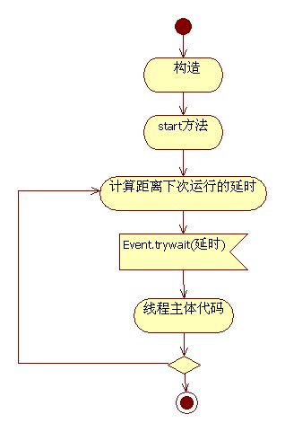
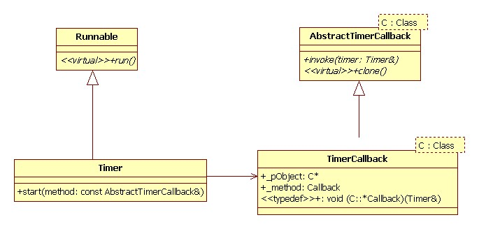

# 定时器
Poco::Timer提供了定时任务的功能，从线程池中创建一个线程，每隔一段时间让线程中的主体代码执行一次。其余时间此线程阻塞在Event.trywait(long seconds)调用上，来达到定时的目的。  
  
我认为这个功能的一个遗憾是没有提供在一个给定时间执行线程的构造函数。构造函数有两个参数，一个是两次执行之间的时间间隔；另一个是初次执行时的延时。 
  


## poco c++定时器本质分析  
定时器作为线程的扩展，也是编程时经常会被用到的元素。
在程序设计上，定时器的作用是很简单。预定某个定时器，即希望在未来的某个时刻，程序能够得到时间到达的触发信号。
本定时器的应用场景很明确了：在线程中定时执行任务，如定时发送请求报文，定时备份数据。
编程时，一般对定时器使用有下面一些关注点：
1. 定时器的精度。Poco中的定时器精度并不是很高，具体精度依赖于实现的平台(Windows or Linux)
2. 定时器是否可重复，即定时器是否可触发多次。 Poco中的定时器精度支持多次触发也支持一次触发，由其构造函数Timer决定
3. 一个定时器是否可以设置多个时间。 Poco中定时器不支持设置多个时间，每个定时器对应一个时间。如果需要多个时间约定的话，使用者要构造多个定时器。

## poco c++定时器的应用步骤
### 定义定时器变量  
```
class MovieMode
{
    Poco::Timer m_timerRestartLive;
};
```
### 声明并实现回调函数
```
void OnTimerReStart(Poco::Timer& timer);
void MovieMode::OnTimerReStart(Poco::Timer& timer);
{
}
```
### 设置时间间隔
```
m_timerRestartLive.setStartInterval(10000);     //第一次，多长时间启动
m_timerRestartLive.setPeriodicInterval(1000); //设置定时时间间隔
可以这样写的： Timer timer(2500, 500);
```
### 注册回调函数
```
Poco::TimerCallback<MovieMode> timerCallback(*this, &MovieMode::OnTimerReStart);
```
### 开启定时器
```
m_timerRestartLive.start(timerCallback, *BigThreadPool::GetInstance());
```
### 退出定时器
```
m_timerRestartLive.stop(); 
```
## 程序例子
程序的涵义：程序启动2.5秒后，开启定时器，在余下的2.5秒内，每隔0.5秒，执行一次。
```
#include "Poco/Timer.h"
#include "Poco/Thread.h"
#include "Poco/Stopwatch.h"
#include <iostream>
using Poco::Timer;
using Poco::TimerCallback;
using Poco::Thread;
using Poco::Stopwatch;

class TimerExample
{
public:
    TimerExample()
    {
        _sw.start();
    }
    void onTimer(Timer& timer)
    {
        std::cout << "Callback called after " << _sw.elapsed()/1000 << " milliseconds." << std::endl;
    }
private:
    Stopwatch _sw;
};

int main(int argc, char** argv)
{
    TimerExample example;
    Timer timer(2500, 500);
    timer.start(TimerCallback<TimerExample>(example, &TimerExample::onTimer));
    Thread::sleep(5000);
   // timer.stop();
    return 0;
}
```

# Stopwatch计时器案例，还有json与各种流
```
#include "Poco/JSON/Parser.h"
#include "Poco/JSON/ParseHandler.h"
#include "Poco/JSON/JSONException.h"
#include "Poco/Environment.h"
#include "Poco/Path.h"
#include "Poco/File.h"
#include "Poco/FileStream.h"
#include "Poco/StreamCopier.h"
#include "Poco/Stopwatch.h"
#include <iostream>

int main(int argc, char **argv)
{
    Poco::Stopwatch sw;

    std::string dir = "./"; //Poco::Environment::get("PATH") + "/JSON/samples/Benchmark/";
    Poco::Path  filePath(dir, "test.json");

    std::ostringstream ostr;

    if (filePath.isFile()) {
        Poco::File inputFile(filePath);

        if (inputFile.exists()) {
            sw.start();
            Poco::FileInputStream fis(filePath.toString());
            Poco::StreamCopier::copyStream(fis, ostr);
            sw.stop();
        } else {
            std::cout << filePath.toString() << " doesn't exist!" << std::endl;
            return 1;
        }
    }

    std::cout << "JSON Benchmark" << std::endl;
    std::cout << "==============" << std::endl;

    std::string jsonStr = ostr.str();
    std::cout << "Total of " << jsonStr.size() << " bytes," << std::endl << "loaded in " << sw.elapsed() << " [us]," << std::endl;

    std::cout << std::endl << "POCO JSON barebone parse" << std::endl;
    Poco::JSON::Parser sparser(0);
    sw.restart();
    sparser.parse(jsonStr);
    sw.stop();
    std::cout << "---------------------------------" << std::endl;
    std::cout << "[std::string] parsed in " << sw.elapsed() << " [us]" << std::endl;
    std::cout << "---------------------------------" << std::endl;

    Poco::JSON::Parser  iparser(0);
    std::istringstream  istr(jsonStr);
    sw.restart();
    iparser.parse(istr);
    sw.stop();
    std::cout << "----------------------------------------" << std::endl;
    std::cout << "[std::istringstream] parsed in " << sw.elapsed() << " [us]" << std::endl;
    std::cout << "----------------------------------------" << std::endl;

    std::cout << std::endl << "POCO JSON Handle/Stringify" << std::endl;
    try
    {
        Poco::JSON::Parser sparser;
        sw.restart();
        sparser.parse(jsonStr);
        Poco::DynamicAny result = sparser.result();
        sw.stop();
        std::cout << "-----------------------------------------" << std::endl;
        std::cout << "[std::string] parsed/handled in " << sw.elapsed() << " [us]" << std::endl;
        std::cout << "-----------------------------------------" << std::endl;

        Poco::JSON::Parser  isparser;
        std::istringstream  istr(jsonStr);
        sw.restart();
        isparser.parse(istr);
        result = isparser.result();
        sw.stop();
        std::cout << "------------------------------------------------" << std::endl;
        std::cout << "[std::istringstream] parsed/handled in " << sw.elapsed() << " [us]" << std::endl;
        std::cout << "------------------------------------------------" << std::endl;

        // Serialize to string
        Poco::JSON::Object::Ptr obj;

        if (result.type() == typeid(Poco::JSON::Object::Ptr)) {
            obj = result.extract <Poco::JSON::Object::Ptr> ();
        }

        std::ostringstream out;
        sw.restart();
        obj->stringify(out);
        sw.stop();
        std::cout << "-----------------------------------" << std::endl;
        std::cout << "stringified in " << sw.elapsed() << " [us]" << std::endl;
        std::cout << "-----------------------------------" << std::endl;
        std::cout << std::endl;
    }
    catch(Poco::JSON::JSONException jsone)
    {
        std::cout << jsone.message() << std::endl;
    }

    return 0;
}
```