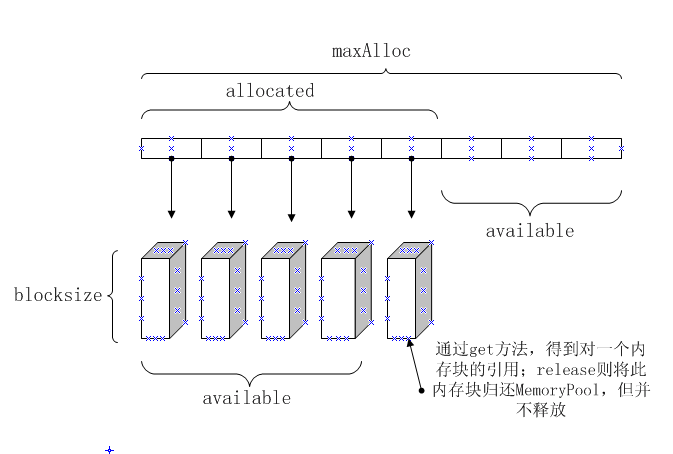

# 双语ppt
  
# 相关概念
### 引用计数
1. 无论何时一个引用被销毁或重写，它所引用的对象的引用计数减少。
2. 无论何时一个引用被创建或拷贝，它所引用的对象的引用计数增加。
3. 初始时的引用计数是1。
4. 当一个对象的引用计数为0时，这个对象资源被销毁。
5. 在多线程环境下，增加和减少操作必须是原子的操作。
### 对象拥有权
1. 如果某人拥有一个对象的拥有权，那么他有责任在对象不需要的时候删除这个对象。
2. 如果对象的拥有者销毁资源失败，那么就会导致一个内存漏失。
3. 其他人也可以指向这个对象，但是，他们绝不销毁这个对象。
4. 拥有权是可以转移的，但是，在任何一个给定的时刻，仅有一个拥有者。
### 二者关系
1. 一个拥有有引用计数性质的对象的指针不将增加这个引用的引用计数。
2. 这说明没有先前的拥有者，换句话说，这个对象刚刚被创建。
3. 或者先前的拥有者放弃了拥有权，因此他也不减少所持有对象的引用计数。
4. 通常，第一个在对象创建后被对象赋值的指针拥有拥有权，其他的则不。

# RefCountedObject
1.  Poco::RefCountedObject实现了一个线程安全的引用计数功能，其中封装了原子计数类AtomicCounter
2.  可以用来作为想实现引用计数功能类的基类。
3.  Poco::RefCountedObject有一个保护的析构函数
4.  所有的引用计数对象应该有一个保护的析构函数，以免显示的delete操作发生。
5.  其中duplicate()用来增加引用计数数目，每次调用引用计数增加1；release()用来减少引用计数数目，每次调用引用计数减少1.
6.  事实上AutoPtr支持一切实现duplicate()和release()的引用计数对象
# AutoPtr
0. Poco::AutoPtr实现了一个引用计数的智能指针，Poco::AutoPtr可以被任何支持引用计数特性的类实例化
1. 被AutoPtr管理的类必须维持一个引用计数，这里定义为count，在调用构造函数时把该引用计数初始化为1
2. 被AutoPtr管理的类必须定义void duplicate()方法，该方法使引用计数count增1
3. 被AutoPtr管理的类必须定义void release()方法，该方法使引用计数count减1，并且当引用计数为0时，删除该对象
4. AutoPtr构造和赋值：
    1.  当从一个C*构造AutoPtr< C >,AutoPtr拥有C的拥有权，引用计数不变。
    2.  当赋值一个C*到AutoPtr< C >，AutoPtr拥有C的拥有权，引用计数不变。
    3.  当从另外一个AutoPtr< C >构造AutoPtr< C >，这两个AutoPtr共享C的拥有权，引用计数增加。
    4.  当赋值另一个AutoPtr< C >到AutoPtr< C >，这两个AutoPtr共享C的拥有权，引用计数增加。
5. AutoPtr操作和语义：
    1.  Poco::AutoPtr支持相关的操作：==,!=,<,<=,>,>=。
    2.  当进行解引用操作:*,->，如果指针为空，抛出NullpointerException异常。
    3.  Poco::AutoPtr支持完全的值操作相关语义:默认构造函数，拷贝构造函数，赋值，它也可以被用在集合：std::vector等中。
    4.  使用AutoPtr::isNull()或者AutoPtr::operator !()测试是否指针为空。
# RefCountedObject与AutoPtr的最佳实践案例
```
#include "Poco/AutoPtr.h"
#include "Poco/RefCountedObject.h"
#include <iostream>
class A: public Poco::RefCountedObject
{
public:
    A() {}
    void greet() const
    {
        std::cout << "Hello, world!" << std::endl;
    }
protected:
    ~A() {}
};
int main(int argc, char** argv)
{
    Poco::AutoPtr<A> p1(new A);  // 构造对象
    p1->greet();                    // 调用方法
    (*p1).greet();                  // 调用方法
    A* ptr1 = p1;                   // 获取裸指针
    A* ptr2 = p1.get();             // 获取裸指针
    std::cout << p1->referenceCount() << std::endl; // 引用计数1
    {
        Poco::AutoPtr<A> p2(p1, true); // Okay: p2 shares ownership with p1
        std::cout << p1->referenceCount() << std::endl; // 2
    }
    std::cout << p1->referenceCount() << std::endl; // 1
    {
        Poco::AutoPtr<A> p3;
        p3.assign(p1, true); // Okay: p3 shares ownership with p1
        std::cout << p3->referenceCount() << std::endl; // 2
        p3 = nullptr;
        std::cout << p1->referenceCount() << std::endl; // 1
    }
    {
        Poco::AutoPtr<A> p2 = p1;
        std::cout << p2->referenceCount() << std::endl; // 2
        p2 = 0;
        std::cout << p2.isNull() << std::endl;          // 判断是否为空1
        std::cout << !p1 << std::endl;                  // 判断是否为空0
        std::cout << p1->referenceCount() << std::endl; // 1
    }
    return 0;
}
```
         
# SharedPtr
Poco::SharedPtr 实现了针对类的引用计数功能，而这些类不需要自己实现引用计数(AutoPtr的duplicate()和release()函数)。  
Poco::SharedPtr有着和Poco::AutoPtr相同的解引用以及相关操作。  
警告：赋值指向普通对象的指针到不同的Poco::SharedPtr将导致多个拥有者的产生，进而引起未定义的行为，换句话说，就是crash。  
一旦你对一个对象使用Poco::SharedPtr，就不要再使用是想那个对象的指针了。  
Poco::AutoPtr是使用继承关系来实现的智能指针，而Poco::SharedPtr是聚合方法实现的智能指针。  

SharedPtr操作符和值语义
1. Poco::SharedPtr同样支持关系操作符==, !=, <, <=, >, >=；
2. 当Poco::SharedPtr中原生指针为空时，使用解引用操作符“*”或者"->"，Poco::SharedPtr会抛出一个NullPointerException 异常。
3. Poco::SharedPtr同样支持全值语义，包括默认构造函数，拷贝构造函数，赋值函数并且同样可以用于各类容器(如std::vector 和 std::map)
4. 可以用SharedPtr::isNull()和SharedPtr::operator ! () 去检查内部的原生指针是否为空。
# SharedPtr最佳实践案例
```
#include "Poco/SharedPtr.h"
#include <string>
#include <iostream>
using Poco::SharedPtr;
int main(int argc, char** argv)
{
    std::string* pString = new std::string("hello, world!");
    Poco::SharedPtr<std::string> p1(pString);
    std::cout << p1.referenceCount() << std::endl;          // 1
    {
        Poco::SharedPtr<std::string> p2(p1);
        std::cout << p1.referenceCount() << std::endl;      // 2
        p2 = nullptr;   // 放弃共享拥有权
        std::cout << p1.referenceCount() << std::endl;      // 1
        // p2 = pString;   // 错误使用方式，详见说明
        p2 = p1; // 正确方式，详见说明
        std::cout << p1.referenceCount() << std::endl;      // 2
    }
    std::cout << p1.referenceCount() << std::endl;          // 1
    std::string::size_type len = p1->length();              // dereferencing with ->
    std::cout << *p1 << std::endl;                          // dereferencing with *
    std::cout << p1.isNull() << std::endl;
    return 0;
}
// rc == 0 -> deleted

有一份对象资源，分别被两个无任何关系的Poco::SharedPtr持有，所以各自的引用计数都是一。而在Poco::SharedPtr内部的析构函数中，会进行这个引用计数值的判断(先减1，再判断是否为0，为0就 delete 持有的资源)。好了，分别析构后，都得到引用计数为0，就产生了两次delete 资源，进而crash。

解决方法就是让其中一个Poco::SharedPtr的引用计数以另一个Poco::SharedPtr引用计数为基础，在其上加1.这样，最终得到0的情况只会发生在一个Poco::SharedPtr身上。

如何建立者两个Poco::SharedPtr的关系呢，那就是拷贝构造函数和=操作符。=操作符的内部产生了一个临时的tmp，通过swap把tmp的_ptr,_pCounter的值交换到this中相应的值中去。 （详见SharedPtr代码）
```
# SharedPtr和数组
默认的SharedPtr删除策略是指删除对象。如果创建对象时使用数组，并把它委托给SharedPtr，必须使用对应数组删除策略。这时候SharedPtr的模板参数中ReleasePolicy应该使用类ReleaseArrayPolicy
```
char* arr = new char[100];
SharedPtr<char,Poco::ReferenceCounter,Poco::ReleaseArrayPolicy<char>> ptr(arr);
```
其实Poco::SharedPtr模板定义是：
```
template <class C, class RC = ReferenceCounter, class RP = ReleasePolicy<C> >     
class SharedPtr
```
因为第二个和第三个模板参数已经有默认的了，且都有确实实现，所以默认是管理一个对象。当把第三个参数换成内部已经存在的
```
Poco::ReleaseArrayPolicy<C>
```
后，从名字也可以看出，它可以管理数组了。
总结一下三个模板参数的意义：
1. class C：要管理的对象类型
2. class RC：执行引用计数的实现方法
3. class RP：实现最后析构被管理的对象的方法

# AutoReleasePool
AutoReleasePool类的出现也同样是为了解决用户动态分配对象的释放问题，但同智能指针AutoPtr和SharedPtr通过把堆上的对象包装成栈对象，再通过引用计数在类的析构函数中实现自动删除对象的解决方案不同是，其策略为构造一个容器，用来存储动态对象的指针，在AutoReleasePool析构函数中统一释放。  
这个过程和java语言中的垃圾收集机制是类似的，只不过AutoReleasePool实现的非常简单，在AutoReleasePool销毁时释放资源，而在java语言中会连续不断的定时检查并释放闲置资源。当然为了实现这个过程，AutoReleasePool对所释放的类是有要求的，释放的类必须实现release()接口。
# AutoReleasePool配合RefCountedObject的最佳实践
```
#include <Poco/RefCountedObject.h>
#include <Poco/Format.h>
#include <Poco/AutoReleasePool.h>

#include <string>
#include <list>

#include "ScopedLogMessage.h"
#include "PrepareConsoleLogger.h"

const int kNumObjects = 3;

class MyObject;	// forward declaration

class MyObjectOwner
{
public:
    MyObjectOwner(ScopedLogMessage& msg) :
            m_Msg(msg)
    {
        m_Msg.Message(" MyObjectOwner created");
    }

    ~MyObjectOwner()
    {
        m_AutoReleasePool.release();
        m_Msg.Message(" MyObjectOwner deleted");
    }

    void addObject(MyObject* pObject)
    {
        m_MyObjectList.push_back(pObject);
        m_AutoReleasePool.add(pObject);
    }

    std::list<MyObject*>& getObjectList()
    {
        return m_MyObjectList;
    }

private:
    ScopedLogMessage&				m_Msg;
    std::list<MyObject*>			m_MyObjectList;
    Poco::AutoReleasePool<MyObject>	m_AutoReleasePool;
};

class MyObject : public Poco::RefCountedObject
{
public:
    MyObject(ScopedLogMessage& msg, int id) :
            m_Msg(msg)
            ,	m_Name("MyObject" + Poco::format("%d", id))
    {
        m_Msg.Message(Poco::format("  %s created", m_Name));
    }

    const std::string& name() const
    {
        return m_Name;
    }

private:
    ~MyObject()
    {
        m_Msg.Message(Poco::format("  %s deleted", m_Name));
    }

    ScopedLogMessage&	m_Msg;
    const std::string	m_Name;
};

int main(int /*argc*/, char** /*argv*/)
{
    PrepareConsoleLogger logger(Poco::Logger::ROOT, Poco::Message::PRIO_INFORMATION);

    ScopedLogMessage msg("AutoReleasePoolTest ", "start", "end");

    MyObjectOwner owner(msg);

    for(int i=0; i<kNumObjects; ++i)
    {
        owner.addObject(new MyObject(msg, i));
    }

    std::list<MyObject*>::iterator itr = owner.getObjectList().begin();
    std::list<MyObject*>::iterator itrEnd = owner.getObjectList().end();
    while(itr != itrEnd)
    {
        msg.Message(Poco::format("   name() = %s", (*itr)->name()));
        ++itr;
    }

    return 0;
}
```
# 动态工厂模板（DynamicFactory Class Template）
高级语言里如java有反射，可以根据类名动态生成类实例；也可以动态获取类成员变量和函数。它就是模板类DynamicFactory，它的原理很简单，通过注册名字，将名字与类型储存在map中。使用的时候根据名字找寻对应的类型，然后生成该类型的实例。  
# DynamicFactory+SharedPtr+dynamic_cast多态转型的简单案例
```
#include <Poco/DynamicFactory.h>
#include <Poco/TypeList.h>
#include <Poco/SharedPtr.h>
#include <iostream>
using Poco::DynamicFactory;
class Base
{
public:
    Base()
    {
    }

    virtual ~Base()
    {
    }

    virtual void fun(){};
};

class A: public Base
{
public:
    void fun() {
        std::cout << "Afun" << std::endl;
    }
    ~A(){
        std::cout << "~A" << std::endl;
    }
};

class B: public Base
{
public:
    void fun() {
        std::cout << "Bfun" << std::endl;
    }
    ~B(){
        std::cout << "~B" << std::endl;
    }
};


int main(int /*argc*/, char** /*argv*/)
{
    DynamicFactory<Base> dynFactory;
    dynFactory.registerClass<A>("A");
    dynFactory.registerClass<B>("B");
    poco_assert (dynFactory.isClass("A"));
    poco_assert (dynFactory.isClass("B"));
    poco_assert (!dynFactory.isClass("C"));
    {
        Poco::SharedPtr<A> a = dynamic_cast<A*>(dynFactory.createInstance("A"));
        Poco::SharedPtr<B> b = dynamic_cast<B*>(dynFactory.createInstance("B"));
        a->fun();
        b->fun();
    }
    {
        Poco::SharedPtr<Base> a = dynFactory.createInstance("A");
        Poco::SharedPtr<Base> b = dynFactory.createInstance("B");
        a->fun();
        b->fun();
    }
    try{
        dynFactory.registerClass<A>("A");
    }
    catch (Poco::ExistsException&)
    {
        std::cout << "already registered - must throw" << std::endl;
    }

    dynFactory.unregisterClass("B");
    poco_assert (dynFactory.isClass("A"));
    poco_assert (!dynFactory.isClass("B"));
    try
    {
        std::unique_ptr<B> b(dynamic_cast<B*>(dynFactory.createInstance("B")));
    }
    catch (Poco::NotFoundException&)
    {
        std::cout << "unregistered - must throw" << std::endl;
    }

    return 0;
}
```
# DynamicFactory+SharedPtr+泛型的高级案例
```
#include <Poco/DynamicFactory.h>
#include <Poco/TypeList.h>
#include <Poco/SharedPtr.h>

#include <string>

#include "ScopedLogMessage.h"
#include "PrepareConsoleLogger.h"

enum EShapeType
{
    eTriangle = 0
    ,	eRectangle
    ,	eOval
    ,	eNumShapes
};

const std::string kShapeNames[] =
        {
                "Triangle"
                ,	"Rectangle"
                ,	"Oval"
        };

class Shape
{
public:
    Shape() :
            m_pMsg(NULL)
    {
    }

    virtual ~Shape()
    {
    }

    void setScopedLogMessage(ScopedLogMessage& msg)
    {
        m_pMsg = &msg;
    }

    virtual void draw(void) = 0;

protected:
    void draw(const std::string& str)
    {
        if(m_pMsg)
        {
            m_pMsg->Message(" " + str);
        }
    }

private:
    ScopedLogMessage* m_pMsg;
};

class TriangleShape : public Shape
{
public:
    void draw(void)
    {
        Shape::draw(std::string("Triangle"));
    }
};

class RectangleShape : public Shape
{
public:
    void draw(void)
    {
        Shape::draw(std::string("Rectangle"));
    }
};

class OvalShape : public Shape
{
public:
    void draw(void)
    {
        Shape::draw(std::string("Oval"));
    }
};

typedef Poco::TypeListType<TriangleShape, RectangleShape, OvalShape>::HeadType ShapeTypeList;

template<EShapeType N>
void RegisterClass(Poco::DynamicFactory<Shape>& shapeFactory)
{
    typedef typename Poco::TypeGetter<N, ShapeTypeList>::HeadType	ShapeType;
    shapeFactory.registerClass<ShapeType>(kShapeNames[N]);
    RegisterClass<static_cast<EShapeType>(N+1)>(shapeFactory);	// recursive call
}

template<>
void RegisterClass<eOval>(Poco::DynamicFactory<Shape>& shapeFactory)
{
    typedef Poco::TypeGetter<eOval, ShapeTypeList>::HeadType	ShapeType;
    shapeFactory.registerClass<ShapeType>(kShapeNames[eOval]);
}

int main(int /*argc*/, char** /*argv*/)
{
    PrepareConsoleLogger logger(Poco::Logger::ROOT, Poco::Message::PRIO_INFORMATION);

    ScopedLogMessage msg("DynamicFactoryTest ", "start", "end");

    Poco::DynamicFactory<Shape> shapeFactory;

    RegisterClass<eTriangle>(shapeFactory);	// recursive register

    Poco::SharedPtr<Shape> shapes[eNumShapes];
    for(std::size_t i=0; i<eNumShapes; ++i)
    {
        shapes[i] = Poco::SharedPtr<Shape>(shapeFactory.createInstance(kShapeNames[i]));
        shapes[i]->setScopedLogMessage(msg);
    }

    for(std::size_t i=0; i<eNumShapes; ++i)
    {
        shapes[i]->draw();
    }

    return 0;
}
```
# AbstractInstantiator抽象工厂
由于在Poco中用Poco::Instantiator类创建对象时使用的是类对象的默认构造函数，所以对于类创建时期望不使用默认构造函数或者对构造函数有一些特殊初始化过程要求的情况，用户必须自己实现抽象构造工厂
# 调用非默认构造的简单案例
```
#include "Poco/DynamicFactory.h"
using Poco::DynamicFactory;
using Poco::AbstractInstantiator;
class Base
{
};
class A: public Base
{
};
class C: public Base
{
public:
    C(int i): _i(i)
    {}
private:
    int _i;
};

class CInstantiator: public AbstractInstantiator<Base>
{
public:
    CInstantiator(int i): _i(i)
    {}
    Base* createInstance() const
    {
        return new C(_i);
    }
private:
    int _i;
};

int main(int argc, char** argv)
{
    DynamicFactory<Base> factory;
    factory.registerClass<A>("A");
    factory.registerClass("C", new CInstantiator(42));
    return 0;
}
```
# 内存池（Memory Pools）
  
get()方法返回内存池中的一个内存块的地址，内存耗尽则会异常  
release()则将内存块还给内存池，但并不delete  
allocated()返回已经分配的内存块数  
avaliable()指示内存池还有多少内存块可以使用  

```
#include <Poco/Format.h>
#include <Poco/MemoryPool.h>
#include <Poco/Stopwatch.h>
#include <Poco/Void.h>

#include <string>

#include "ScopedLogMessage.h"
#include "PrepareConsoleLogger.h"

const std::size_t kBlockSize = 256;
const int kNumMaxAlloc_Basics = 4;
void ShowMemoryPoolAttr(ScopedLogMessage& msg, const Poco::MemoryPool& pool)
{
    msg.Message(Poco::format("  blockSize()=%z, allocated()=%d, available()=%d",
            pool.blockSize(), pool.allocated(), pool.available()));
}

void TestBasics(ScopedLogMessage& msg)
{
    msg.Message("--- TestBasics ---");

    Poco::MemoryPool pool(kBlockSize, 0, kNumMaxAlloc_Basics);
    msg.Message(Poco::format(" Poco::MemoryPool(%z, %d, %d)",
            kBlockSize, 0, kNumMaxAlloc_Basics));
    ShowMemoryPoolAttr(msg, pool);

    std::vector<void*> ptrs;
    msg.Message(" pool.get()");
    for(int i=0; i<kNumMaxAlloc_Basics; ++i)
    {
        char* buffer = reinterpret_cast<char*>(pool.get());
        strcpy(buffer, "abced");
        ptrs.push_back(buffer);
        ShowMemoryPoolAttr(msg, pool);
    }
    try
    {
        pool.get();
    }
    catch(Poco::OutOfMemoryException&)
    {
        msg.Message(Poco::format(" calling pool.get() more than %d fails", kNumMaxAlloc_Basics));
    }
    msg.Message(" pool.release()");
    for(int i=0; i<kNumMaxAlloc_Basics; ++i)
    {
        pool.release(ptrs[i]);
        ShowMemoryPoolAttr(msg, pool);
    }
    msg.Message(" pool.get() again");
    for(int i=0; i<kNumMaxAlloc_Basics; ++i)
    {
        ptrs.push_back(pool.get());
        ShowMemoryPoolAttr(msg, pool);
    }
}

int main(int /*argc*/, char** /*argv*/)
{
    PrepareConsoleLogger logger(Poco::Logger::ROOT, Poco::Message::PRIO_INFORMATION);
    ScopedLogMessage msg("MemoryPoolTest ", "start", "end");
    TestBasics(msg);
    return 0;
}
```
# 单件（Singletons）
```
#include <Poco/SingletonHolder.h>

#include <string>

#include "ScopedLogMessage.h"
#include "PrepareConsoleLogger.h"

ScopedLogMessage* g_pMsg = NULL;

class SingletonTarget
{
public:
    SingletonTarget()
    {
        if(NULL != g_pMsg)
        {
            g_pMsg->Message("  SingletonTarget created.");
        }
    }

    ~SingletonTarget()
    {
        if(NULL != g_pMsg)
        {
            g_pMsg->Message("  SingletonTarget deleted.");
        }
    }

    void doSomething(void)
    {
        if(NULL != g_pMsg)
        {
            g_pMsg->Message("  SingletonTarget::doSomething called.");
        }
    }

private:
    SingletonTarget(const SingletonTarget&);
    SingletonTarget& operator = (const SingletonTarget&);
};

class ClassWithDefaultInstance
{
public:
    ClassWithDefaultInstance()
    {
        if(NULL != g_pMsg)
        {
            g_pMsg->Message("  ClassWithDefaultInstance created.");
        }
    }

    ~ClassWithDefaultInstance()
    {
        if(NULL != g_pMsg)
        {
            g_pMsg->Message("  ClassWithDefaultInstance deleted.");
        }
    }

    void doSomething(void)
    {
        if(NULL != g_pMsg)
        {
            g_pMsg->Message("  ClassWithDefaultInstance::doSomething called.");
        }
    }

    static ClassWithDefaultInstance& defaultInstance()
    {
        static Poco::SingletonHolder<ClassWithDefaultInstance> sh;
        return *sh.get();
    }

private:
    ClassWithDefaultInstance(const ClassWithDefaultInstance&);
    ClassWithDefaultInstance& operator = (const ClassWithDefaultInstance&);
};

int main(int /*argc*/, char** /*argv*/)
{
    PrepareConsoleLogger logger(Poco::Logger::ROOT, Poco::Message::PRIO_INFORMATION);

    ScopedLogMessage msg("SingletonHolderTest ", "start", "end");
    g_pMsg = &msg;

    {
        msg.Message(" --- SingletonTarget ---");
        Poco::SingletonHolder<SingletonTarget> singleton;
        singleton.get()->doSomething();
        singleton.get()->doSomething();
    }
    {
        msg.Message(" --- ClassWithDefaultInstance ---");
        ClassWithDefaultInstance::defaultInstance().doSomething();
        ClassWithDefaultInstance::defaultInstance().doSomething();
    }
    return 0;
}
```