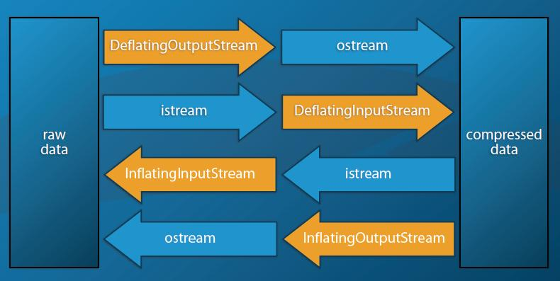

# C++流及文件操作
C++中引入了流了概念，相对C中对文件操作的函数，流是更加高层级的一个概念，这在JAVA等语言中主要是通过流来对文件进行操作。流就相当于一个管道，管道的另外一端连接一个具体的文件或者其它资源，通过流向其中写入数据就相当于把输入写入到资源中了，向流中取数据，就相当于从资源读取到数据了。这样，我们在操作资源时，面对的仅仅是流这么一个简单的概念，不再需要去关注具体的资源。假如流的一端是关联一个文件，操作流就相当于读写文件了。假如流的另一端关联的是字符串，操作流就相当于读写字符串了。甚至，可以将流关联到一个socket中，操作流就相当于通过socket读取和发送数据了。因为流的接口使用很简单，又统一，很多时候我们只需要将与具体资源的交互封装起来，再使用时就方便很多了。另外，基于流这么一个概念，以及流是一个一个处理数据的逻辑，多个流可以串联起来，实现很多扩展功能，比如处理文件的换行符，统计文件字数，编码转换，压缩与解压缩等等功能。
# C++标准库中流的组成
不管概念上怎么说，流本质上还是一种操作资源的方法，始终还是无法避免直接操作资源。但是，C++标准库在设计的时候，对于资源的操作和对于流状态、控制信息的维护这两个工作是分开的，这样的设计能够使得逻辑更加清晰，更加易于扩展和维护。在C++标准库中，负责维护流状态的工作是iostream、fstream等流类，我们直接操作的也是这些接口。负责与资源打交道的是流类隐藏的buf类，有filebuf、stringbuf、streambuf等。实际上我们在自定义流的时候，一个很大部分的工作就是在自定义流buf。
# 标准库中流相关类
- ios_base: 封装了C++标准中的流，定义了在输入输出中不依赖于读写的数据类型的基本信息和行为，如格式化信息、异常状态、事件回调等。
- ios: 所有流的基类，base_ios< char>的typedef。
- istream/ostream/iostream : 提供>>操作符的功能，从缓冲区中提供目标值。提供<<操作符的功能，<<操作符在输出数据时会根据格式化控制信息格式化要输出的数据。
- fstream/ifstream/ofstream： 对文件操作的类。
- stringstream/istringstream/ostringstream ： 对字符串操作的类
- streambuf/filebuf/stringbuf： 上述几种流的内部buf类。
# 流的操作
除了能通过>>和<<来对流进行操作之外，标准库的流也提供类似与对资源的直接读/写大块二进制的操作。支持的有：read、write、tellg、tellp、seekg、get、getline、fail、good、flush、ignore、bad。
# 自定义流
标准库的tream对象的所有操作最终都委托给了内部的buf，对stream的对象的读写操作都是对buf的状态的改变。buf里面维护了多个指针用来辅助读写。在通过stream读写时，buf内部的状态会改变，会在适当的时候自动从资源读或者写操作。  
自定义流，其实大部分是自定义buf管理对象。在标准库的各种资源管理buf中，主要是overflow、underflow、sync这么几个函数会与实际的文件进行交互，因此自定义资源管理buf主要也是重写这些会与实际资源交互的函数。
# Poco中流相关接口
  类  | 说明  
  :-: | :-: 
BasicUnbufferdStreamBuf |继承自streambuf，Poco自定义buf的基类
BasicBufferedStreamBuf 	|继承自streambuf，Poco自定义buf的基类
BasicBufferedBidirectionalStreamBuf |继承自streambuf，Poco自定义buf的基类
***IOS |各种流的操作接口，虚拟继承自std::ios
Base32Decoder 	|Base32解密流
Base32Encoder 	|Base32加密流
Base64Decoder 	|Base64解密流
Base64Encoder 	|Base64加密流
CountingOutputStream 	|继承自CountingIOS和ostream的计数流
CountingInputStream 	|继承自CountingIOS和istream的计数流
DeflatingInputStream 	|继承自DeflatingIOS和istream的压缩流
DeflatingOutputStream 	|继承自DeflatingIOS和ostream的解压流
InflatingInputStream 	|继承自InflatingIOS和istream的压缩流
InflatingOutputStream 	|继承自InflatingIOS和ostream的解压流
HexBinaryDecoder 	|Base16解密流
HexBinaryEncoder 	|Base16加密流
OutputLineEndingConverter 	|行尾符号转换输出流
InputLineEndingConverter 	|行尾符号转换输入流
TeeOutputStream 	|三通流
FileInputStream 	|文件操作输入流
FileOutputStream 	|文件操作输出流
MemoryOutputStream 	|内存操作输出流
MemoryInputStream 	|内存操作输入流
BinaryWriter 	|写7bit编码的二进制文件
BinaryReader 	|读7bit编码的二进制文件
StreamCopier 	|流赋值，用于连接2个流的工具类
StreamTokenizer |	


# CountingInputStream和CountingOutputStream
可以用来统计文件中的字符数目和行数，同时它们也可以提供当前所在行和列数
```
int main(int /*argc*/, char** /*argv*/)
{
    char c;
    std::istringstream istr1("foo");
    Poco::CountingInputStream ci1(istr1);
    while (ci1.good()) ci1.get(c);
    poco_assert (ci1.lines() == 1);
    poco_assert (ci1.chars() == 3);
    poco_assert (ci1.pos() == 3);

    std::ostringstream ostr2;
    Poco::CountingOutputStream co2(ostr2);
    co2 << "foo\nbar";
    poco_assert (ostr2.str() == "foo\nbar");
    poco_assert (co2.lines() == 2);
    poco_assert (co2.chars() == 7);
    poco_assert (co2.pos() == 3); // 当前所在行的第几个字符

    return 0;
}
```
# InputLineEndingConverter和OutputLineEndingConverter
Poco::InputLineEndingConverter和Poco::OutputLineEndingConverter用来转换不同操作系统上的文本文件的行结尾(Unix (LF)、DOS/Windows (CRLF)、Macintosh (CR))
```
#include "Poco/LineEndingConverter.h"
#include "Poco/StreamCopier.h"
#include <sstream>

using Poco::LineEnding;
using Poco::InputLineEndingConverter;
using Poco::OutputLineEndingConverter;
using Poco::StreamCopier;
int main(int /*argc*/, char** /*argv*/)
{
    std::istringstream input("line1\r\nline2\r\nline3\r\n");
    std::ostringstream output;
    Poco::InputLineEndingConverter conv(input, LineEnding::NEWLINE_LF);
    Poco::StreamCopier::copyStream(conv, output);
    std::string result = output.str();
    poco_assert (result == "line1\nline2\nline3\n");
    return 0;
}
```
# TeeInputStream和TeeOutputStream
 Poco::TeeInputStream和Poco::TeeOutputStream流会拷贝所有的输入和输出字符串，并把它们输出到一个或多个流上。这两个类主要被用于调试情况下。
```
#include "Poco/TeeStream.h"
#include <iostream>
#include <fstream>
using Poco::TeeOutputStream;
int main(int argc, char** argv)
{
    TeeOutputStream tee(std::cout);
    std::ofstream fstr("output.txt");
    tee.addStream(fstr);
    tee << "Hello, world!" << std::endl;
    return 0;
}
```
# ZLib流，压缩（DeflatingOutputStream、DeflatingInputStream）与解压（InflatingInputStream、InflatingOutputStream）
在Poco库中，存在两个流类用来把原始数据转换成为压缩数据，分别是DeflatingInputStream和DeflatingOutputStream。这两个类通过另外一个输入、输出流构建，并可以指定数据的压缩格式。
- Poco::DeflatingStreamBuf::STREAM_ZLIB (deflate/zlib 格式)
- Poco::DeflatingStreamBuf::STREAM_GZIP (gzip 格式)  

而Poco::InflatingInputStream类和Poco::InflatingOutputStream类，用来把压缩数据还原成为原始数据。同样的它们也是通过另外一个输入、输出流构建，并可以指定数据的压缩格式。
- Poco::InflatingStreamBuf::STREAM_ZLIB (deflate/zlib 格式)
- Poco::InflatingStreamBuf::STREAM_GZIP (gzip 格式)


```
#include "Poco/DeflatingStream.h"
#include "Poco/InflatingStream.h"
#include <fstream>
using Poco::DeflatingOutputStream;
using Poco::DeflatingStreamBuf;
using Poco::InflatingInputStream;
using Poco::InflatingStreamBuf;
#include <string>
int main(int argc, char** argv)
{
    std::ofstream ostr("test.gz", std::ios::binary);
    DeflatingOutputStream deflater(ostr, DeflatingStreamBuf::STREAM_GZIP);
    deflater << "Hello, world! ads \n" << "12306";
    // ensure buffers get flushed before connected stream is closed
    deflater.close();
    ostr.close();

    std::ifstream istr("test.gz", std::ifstream::in);
    InflatingInputStream infalter(istr ,InflatingStreamBuf::STREAM_GZIP);
    std::string str;
    while (infalter.good())          // loop while extraction from file is possible
    {
        char c = infalter.get();    // get character from file
        str.append(1, c);
    }

    return 0;
}
在上面那个例子里，使用析取操作符">>"，会使空格和换行符丢失，所以只能逐一获取字符。
```
# Base64Encoder和Base64Decoder
Base64常用于在通常处理文本数据的场合，表示、传输、存储一些二进制数据。包括MIME的email，email via MIME, 在XML中存储复杂数据
```
#include "Poco/Base64Encoder.h"
#include <iostream>
using Poco::Base64Encoder;
int main(int argc, char** argv)
{
       Base64Encoder encoder(std::cout);
       encoder << "Hello, world!";
       return 0;
}
```
# HexBinaryEncoder和HexBinaryDecoder
HexBinary编码又叫Base16编码，案例见综合案例
# FileStream, FileInputStream, FileOutputStream
FileStream、FileInputStream、FileOutputStream流用于读取和写入文件。在windows平台上，传给文件流的路径必须是UTF-8编码。Poco中文件流类总是以二进制方式打开文件，并且支持文件的seek操作
```
#include <assert.h>
#include "Poco/FileStream.h"
#include "Poco/File.h"
#include "Poco/TemporaryFile.h"
#include "Poco/Exception.h"

int main(int argc, char** argv)
{
    Poco::FileOutputStream ostr("test.txt");
    ostr << "0123456789";
    ostr.close();

    Poco::FileStream str1("test.txt", std::ios::ate);
    int c = str1.get();
    assert (str1.eof());

    str1.clear();
    str1.seekg(0);
    c = str1.get();
    assert (c == '0');

    str1.close();

    Poco::FileStream str2("test.txt", std::ios::ate);
    str2 << "abcdef";
    str2.seekg(0);
    std::string s;
    str2 >> s;
    assert (s == "0123456789abcdef");
    str2.close();

    return 0;
}
```
# NullInputStream和NullOutputStream
Poco::NullOutputStream类会抛弃所有对它的写操作，对所有的读操作会返回文件结束符
```
#include <assert.h>
#include "Poco/NullStream.h"

using Poco::NullInputStream;
using Poco::NullOutputStream;

int main(int argc, char** argv)
{
    NullInputStream istr;
    assert (istr.good());
    assert (!istr.eof());
    int c = istr.get();
    assert (c == -1);
    assert (istr.eof());
    return 0;
}
```
# BinaryWriter和BinaryReader
Poco::BinaryWriter被用作向一个输出流中写入基础数据类型的二进制形式。Poco::BinaryReader被用作从一个保存着Poco::BinaryWriter类存储的二进制形式的内容的输入流中读取基础数据类型的数据。
Poco::BinaryReader和Poco::BinaryWriter类都支持大小字节序的数据读写，并且能够在内部转换所需的字节序。这两个类主要用于不同架构的操作系统之间的数据转换。  
## BinaryWriter
支持所有c++内建数据类型、c风格的字符串和std::string的插入操作符"<<"。在Poco::BinaryWriter类中无符号整型(包括32和64位)的存储是以一种特殊的7位编码方式进行的。
### BinaryWriter成员函数:
- void write7BitEncoded(UInt32 value)
- void write7BitEncoded(UInt64 value)
向底层输出流以简洁7位编码方式写入一个无符号整形
- void writeRaw(const std::string& rawData)
向底层输出流写入裸数据
- void writeBOM()
向流中写入一个字节序标志BOM(byte order mark)(一个16位值0xFEFF的本机序)。如果需要的话，BinaryReader会使用BOM标志自动进行字节序转换
### BinaryWriter类和字节序：
BinaryWriter类通过一个输出流和一个字节序标志进行构造。字节序标志有如下选择：
- NATIVE_BYTE_ORDER           (本机序)
- BIG_ENDIAN_BYTE_ORDER      (大头序)
- NETWORK_BYTE_ORDER          (网络序)
- LITTLE_ENDIAN_BYTE_ORDER    (小头序)
### BinaryWriter流状态
Poco::BinaryWriter提供了一些函数用于判断底层输出流的状态
- void flush()
刷新底层流
- bool good()
如果流状态正常返回真
- bool fail()
如果底层流状态为fail返回真
- bool bad()
如果底层流状态为bad返回真

## BinaryReader
Poco::BinaryReader为所有c++内置数据和std::string提供析取操作符。
### BinaryReader成员函数：
- void read7BitEncoded(UInt32& value)
- void read7BitEncoded(UInt64& value)
读取以7位压缩格式存储的整形值。
- void readRaw(int length, std::string& value)
读取指定长度的裸数据
- void readBOM()
读取字节序标志BOM(byte order mark)，以便在内部自动激活字节序转换
### Poco::BinaryReader流状态
Poco::BinaryReader提供了一些函数用于判断底层输出流的状态
- bool good()
如果流状态正常返回真
-  bool fail()
如果底层流状态为fail返回真
- bool bad()
如果底层流状态为bad返回真
- bool eof()
如果底层状态为eof返回真
```
#include <fstream>
#include <Poco/BinaryWriter.h>
#include "Poco/BinaryReader.h"
using Poco::BinaryWriter;
using Poco::BinaryReader;
int main(int argc, char** argv)
{
    {
        std::ofstream ostr("binary.dat", std::ios::binary);
        BinaryWriter writer(ostr);
        writer.writeBOM();
        writer << "Hello, world!" << 42;
        writer.write7BitEncoded((Poco::UInt32)123);
        writer << true;
    }
    {
        std::ifstream istr("binary.dat", std::ios::binary);
        BinaryReader reader(istr);
        reader.readBOM();
        std::string hello;
        Poco::UInt32 i;
        bool b;
        reader >> hello >> i;
        reader.read7BitEncoded(i);
        reader >> b;
    }
    return 0;
}
```
# 综合案例
```
#include <Poco/FileStream.h>
#include <Poco/File.h>
#include <Poco/StreamCopier.h>
#include <Poco/TeeStream.h>
#include <Poco/InflatingStream.h>
#include <Poco/DeflatingStream.h>
#include <Poco/Base64Encoder.h>
#include <Poco/Base64Decoder.h>
#include <Poco/HexBinaryEncoder.h>
#include <Poco/HexBinaryDecoder.h>
#include <Poco/CountingStream.h>
#include <Poco/Net/QuotedPrintableEncoder.h>
#include <Poco/Net/QuotedPrintableDecoder.h>
#include <Poco/Format.h>
#include <Poco/TemporaryFile.h>

#include <string>
#include <sstream>
#include <iostream>
#include "ScopedLogMessage.h"
#include "PrepareConsoleLogger.h"

typedef void (*TestRoutine)(ScopedLogMessage& msg);

const char* const kSampleText =
        "THE SOFTWARE IS PROVIDED \"AS IS\", WITHOUT WARRANTY OF ANY KIND, EXPRESS OR\n"
        "IMPLIED, INCLUDING BUT NOT LIMITED TO THE WARRANTIES OF MERCHANTABILITY,\n"
        "FITNESS FOR A PARTICULAR PURPOSE, TITLE AND NON-INFRINGEMENT. IN NO EVENT\n"
        "SHALL THE COPYRIGHT HOLDERS OR ANYONE DISTRIBUTING THE SOFTWARE BE LIABLE\n"
        "FOR ANY DAMAGES OR OTHER LIABILITY, WHETHER IN CONTRACT, TORT OR OTHERWISE,\n"
        "ARISING FROM, OUT OF OR IN CONNECTION WITH THE SOFTWARE OR THE USE OR OTHER\n"
        "DEALINGS IN THE SOFTWARE.";

enum
{
    eStandard = 0
    ,	eGZIP
    ,	eZLIB
};

void TestSimple(ScopedLogMessage& msg)
{
    Poco::TemporaryFile file;   // 为了获取临时文件名称
    std::ostringstream ostrBackup; // 字符串输出流

    msg.Message(" --- Simple file wrie/read ---");
    {
        Poco::FileOutputStream ostr(file.path()); // 使用临时文件名创建文件输出流
        Poco::TeeOutputStream tos(ostr);  // 通过一个流将内容输出到多个流中
        tos.addStream(ostrBackup); // 多个流叠加，效果类似log中的输出到终端与文件效果
        tos << kSampleText; // 此时临时文件与ostrBackup中都有内容了
        std::cout << ostrBackup.str() << std::endl;
    }
    msg.Message(Poco::format("  File size        : %z bytes", static_cast<std::size_t>(file.getSize()))); // 文件字节数
    {
        Poco::FileInputStream istr(file.path()); // 文件操作输入流
        std::string str;
        Poco::StreamCopier::copyToString(istr, str); // 将文件输入流copy到字符串中
        msg.Message(Poco::format("  Write/Read check : %s", std::string(0 == str.compare(ostrBackup.str()) ? "OK":"NG")));
    }
}

void TestCountingStream(ScopedLogMessage& msg)
{
    Poco::TemporaryFile file;
    std::ostringstream ostrBackup;

    msg.Message(" --- Simple file wrie/read with counting stream ---");
    {
        Poco::FileOutputStream ostr(file.path());	// 创建文件
        Poco::CountingOutputStream countingOstr(ostr); // 统计输出行数字符数流
        Poco::TeeOutputStream tos(countingOstr);
        tos.addStream(ostrBackup);
        tos << kSampleText;

        msg.Message(Poco::format("  Characters       : %d", countingOstr.chars())); // 统计字符数和行数
        msg.Message(Poco::format("  Lines            : %d", countingOstr.lines()));
    }
    msg.Message(Poco::format("  File size        : %z bytes", static_cast<std::size_t>(file.getSize())));
    {
        Poco::FileInputStream istr(file.path());
        Poco::CountingInputStream countingIstr(istr);
        std::string str;
        Poco::StreamCopier::copyToString(countingIstr, str);
        msg.Message(Poco::format("  Write/Read check : %s", std::string(0 == str.compare(ostrBackup.str()) ? "OK":"NG")));
        msg.Message(Poco::format("  Characters       : %d", countingIstr.chars()));
        msg.Message(Poco::format("  Lines            : %d", countingIstr.lines()));
    }
}

template <class Tenc, class Tdec, int sel>
class TestEncodeDecode
{
public:
    void Test(ScopedLogMessage& msg, const std::string& text)
    {
        Poco::TemporaryFile file;
        std::ostringstream ostrBackup;

        msg.Message(text);
        {
            Poco::FileOutputStream ostr(file.path());
            Tenc* encoder = Encoder(ostr, Int2Type<sel>());
            Poco::TeeOutputStream tos(*encoder);
            tos.addStream(ostrBackup);
            tos << kSampleText;
            delete encoder;
        }
        msg.Message(Poco::format("  File size        : %z bytes (%5.2f%% of original)"
                ,	static_cast<std::size_t>(file.getSize())
                ,	(100.0*file.getSize())/(std::string(kSampleText)).length()));
        {
            Poco::FileInputStream istr(file.path());
            Tdec* decoder = Decoder(istr, Int2Type<sel>());
            std::string str;
            Poco::StreamCopier::copyToString(*decoder, str);
            msg.Message(Poco::format("  Write/Read check : %s"
                    , std::string(0 == str.compare(ostrBackup.str()) ? "OK":"NG")));
            delete decoder;
        }
    }

private:
    template <int v>
    struct Int2Type
    {
        enum {value = v};
    };

    Tenc* Encoder(Poco::FileOutputStream& ostr, Int2Type<eStandard>)
    {
        return (new Tenc(ostr));
    }
    Tenc* Encoder(Poco::FileOutputStream& ostr, Int2Type<eGZIP>)
    {
        return (new Tenc(ostr, Poco::DeflatingStreamBuf::STREAM_GZIP));
    }
    Tenc* Encoder(Poco::FileOutputStream& ostr, Int2Type<eZLIB>)
    {
        return (new Tenc(ostr, Poco::DeflatingStreamBuf::STREAM_ZLIB));
    }
    Tdec* Decoder(Poco::FileInputStream& istr, Int2Type<eStandard>)
    {
        return (new Tdec(istr));
    }
    Tdec* Decoder(Poco::FileInputStream& istr, Int2Type<eGZIP>)
    {
        return (new Tdec(istr, Poco::InflatingStreamBuf::STREAM_GZIP));
    }
    Tdec* Decoder(Poco::FileInputStream& istr, Int2Type<eZLIB>)
    {
        return (new Tdec(istr, Poco::InflatingStreamBuf::STREAM_ZLIB));
    }
};

void TestGZIPCompressed(ScopedLogMessage& msg)
{
    TestEncodeDecode<Poco::DeflatingOutputStream, Poco::InflatingInputStream, eGZIP> test;
    test.Test(msg, " --- GZIP compressing file wrie/read ---");
}

void TestZLIBCompressed(ScopedLogMessage& msg)
{
    TestEncodeDecode<Poco::DeflatingOutputStream, Poco::InflatingInputStream, eZLIB> test;
    test.Test(msg, " --- ZLIB compressing file wrie/read ---");
}

void TestBase64Encoding(ScopedLogMessage& msg)
{
    TestEncodeDecode<Poco::Base64Encoder, Poco::Base64Decoder, eStandard> test;
    test.Test(msg, " --- Base64 encoding file wrie/read ---");
}

void TestHexBinaryEncoding(ScopedLogMessage& msg)
{
    TestEncodeDecode<Poco::HexBinaryEncoder, Poco::HexBinaryDecoder, eStandard> test;
    test.Test(msg, " --- HexBinary encoding file wrie/read ---");
}

void TestQuotedPrintableEncoding(ScopedLogMessage& msg)
{
    TestEncodeDecode<Poco::Net::QuotedPrintableEncoder, Poco::Net::QuotedPrintableDecoder, eStandard> test;
    test.Test(msg, " --- QuotedPrintable encoding file wrie/read ---");
}

int main(int /*argc*/, char** /*argv*/)
{
    PrepareConsoleLogger logger(Poco::Logger::ROOT, Poco::Message::PRIO_INFORMATION);

    ScopedLogMessage msg("FileStreamTest ", "start", "end");

    TestRoutine tests[] = {	TestSimple
            ,	TestCountingStream
            ,	TestGZIPCompressed
            ,	TestZLIBCompressed
            ,	TestBase64Encoding
            ,	TestHexBinaryEncoding
            ,	TestQuotedPrintableEncoding	};

    for(std::size_t i=0; i<sizeof(tests)/sizeof(tests[0]); ++i)
    {
        msg.Message("");
        tests[i](msg);
    }
    msg.Message("");

    return 0;
}
```