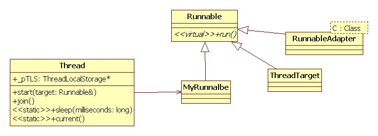
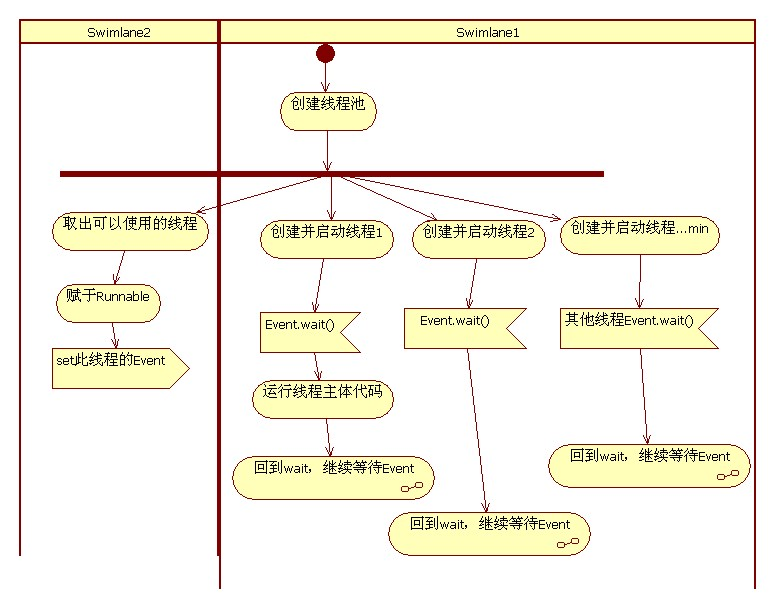

# 线程
Poco实现线程的机制，它将线程Thread和线程运行的实体Runnable分离开来，就像一个框架，Thread管理线程优先级，堆栈，维护线程局部变量；而运行的代码是在Runnable的子类run方法中实现的。
1. Runnable
2. Thread
3. RunnableAdapter
4. ThreadTarget

在MyRunnable中，重写run方法，实现线程逻辑代码，然后调用Thread中的start方法启动线程，用join回收线程资源。静态方法sleep用于延时挺有用的。如果我们想将一个静态方法或全局函数用做线程的代码，可以使用ThreadTarget对那个函数进行包装；类中的非静态方法可以使用RunnableAdapter进行包装，然后用Thread进行调用  

## 传入Runnable对象启动Thread
在Poco中，将入口函数抽象为一个类Runnable，该类提供void run()接口，用户需要继承至该类来实现自定义的入口函数。Poco将线程也抽象为一个类Thread，提供了start, join等方法,如下:
定义一个Thread对象，调用其start方法并传入一个Runnable对象来启动线程，使用的方法比较简单
```
#include "Poco/Thread.h"
#include "Poco/Runnable.h"
#include <iostream>
class HelloRunnable: public Poco::Runnable
{
    virtual void run()
    {
        std::cout << "Hello, world!" << std::endl;
    }
};
int main(int argc, char** argv)
{
    HelloRunnable runnable;
    Poco::Thread thread;
    thread.start(runnable);//传入对象而不是对象指针
    thread.join();
}
```
## 使用RunnableAdapter传入一个普通类成员函数启动Thread

如果你的线程的入口函数在另一个已定义好的类中，那么Poco提供了一个适配器来使线程能够从你指定的入口启动，并且无需修改已有的类：
```
#include "Poco/Thread.h"
#include "Poco/RunnableAdapter.h"
#include <iostream>
class Greeter
{
public:
    void greet()
   {
       std::cout << "Hello, world!" << std::endl;
   }
};
int main(int argc, char** argv)
{
    Greeter greeter;
    Poco::RunnableAdapter<Greeter> runnable(greeter, &Greeter::greet);
    Poco::Thread thread;
    thread.start(runnable);
    thread.join();//等待该线程技术
    return 0;
}
```
## 直接传入全局函数和参数
Thread::start除了接收Runnable对象之外，还可以传入函数和参数
```
#include <iostream>
#include "Poco/Thread.h"
#include "Poco/ThreadLocal.h"
#include "Poco/Runnable.h"

 using namespace std;
 using namespace Poco;

void sayHello(void* name)
{
    cout<<"Hello "<<(char*)name<<endl;
}
int main()
{
    static char* name = "DJWu";
    Thread thr;
    thr.start(sayHello, name);
    thr.join();
    return  0;
}
```

# 线程池
Poco::ThreadPool提供线程池功能，减少线程的创建和销毁所带来的开销，适合在服务器上应用。创建线程池时指定最少运行线程数和线程池的最大容量，若不指定则采用默认值，取2和16 。线程池的实现机制：有一部分线程始终处于运行状态，但阻塞在Event的wait调用上，所以处于休眠状态，开销并不大。如果我们需要一个线程来运行一段代码（在Poco中，用Runnable的子类表示一个target），则从线程池中去除一个线程，并将这段代码赋给它，并触发Event。然后线程就继续运行了。
 
 
POCO线程池主要有两个类，PooledThread和ThreadPool，前者是线程池中的线程，负责执行线程池分配下来的任务，它基于Thread和Runnable机制。后者是线程池类，它负责对线程池中的各个线程进行维护(创建，分配，回收，清除等)。

# 线程池最佳实践，重点使用ThreadPool启动同一个类中的2个函数：run与anotherThread
```
#include <iostream>
#include "Poco/Thread.h"
#include "Poco/Runnable.h"
#include "Poco/ThreadTarget.h"
#include "Poco/RunnableAdapter.h"
#include "Poco/ThreadPool.h"
using namespace std;
using Poco::Thread;
using Poco::Runnable;
using Poco::ThreadTarget;
using Poco::RunnableAdapter;
using Poco::ThreadPool;
//传入对象
class MyRunnable:public Runnable
{
public:
    void run() { std::cout << "hello MyRunnable run." << std::endl; }
    void anotherThread() { std::cout << "hello MyRunnable anotherThread." << std::endl; }
};
//传入函数
void gFun4Td()
{
    std::cout << "hello gFun4Td" << std::endl;
}
//传入类中的静态函数
class staticFun4Td
{
public:
    static void staticFun() { std::cout << "hello static fun." << std::endl; }
};
//传入类成员函数
class commFun4Td
{
public:
    void commFun() { std::cout << "hello common function." << std::endl; }
};

int main()
{
    cout << "1" << endl;
    {
        Thread t1("MyRun");
        Thread t2("global");
        Thread t3("static");
        Thread t4("comm");

        MyRunnable rMy;
        ThreadTarget rg(gFun4Td);
        ThreadTarget rs(&staticFun4Td::staticFun);
        commFun4Td com;
        RunnableAdapter<commFun4Td> rc(com,&commFun4Td::commFun);

        t1.start(rMy);
        Thread::sleep(100);
        t2.start(rg);
        Thread::sleep(100);
        t3.start(rs);
        Thread::sleep(100);
        t4.start(rc);

        t1.join();
        t2.join();
        t3.join();
        t4.join();
    }
    cout << "2" << endl;
    {
        MyRunnable rMy;
        Poco::RunnableAdapter<MyRunnable> rMyAnother(rMy, &MyRunnable::anotherThread);
        ThreadTarget rg(gFun4Td);
        ThreadTarget rs(&staticFun4Td::staticFun);
        commFun4Td com;
        RunnableAdapter<commFun4Td> rc(com,&commFun4Td::commFun);

        Poco::ThreadPool::defaultPool().addCapacity(16);
        Poco::ThreadPool::defaultPool().start(rMy);
        Poco::ThreadPool::defaultPool().startWithPriority(Poco::Thread::Priority::PRIO_LOW, rMyAnother);
        Poco::ThreadPool::defaultPool().start(rg);
        Poco::ThreadPool::defaultPool().start(rs);
        Poco::ThreadPool::defaultPool().start(rc);
        Poco::ThreadPool::defaultPool().joinAll();
    }

    return 0;
}
```
# 线程局部存储TSL
在一个线程修改的内存内容，对所有线程都生效。这是一个优点也是一个缺点。说它是优点，线程的数据交换变得非常快捷。说它是缺点，一个线程死掉了，其它线程也性命不保; 多个线程访问共享数据，需要昂贵的同步开销，也容易造成同步相关的BUG。
ThreadLocal类为开发者提供了更为简洁的TLS机制使用方法，TLS机制用来保存这样一些变量：它们在不同的线程里有不同的值，并且各自维护，线程不能访问其他线程中的这些变量。   
```
#include "Poco/Thread.h"
#include "Poco/Runnable.h"
#include "Poco/ThreadLocal.h"
#include <iostream>
class Counter: public Poco::Runnable
{
    void run()
   {
        static Poco::ThreadLocal<int> tls;
        for (*tls = 0; *tls < 10; ++(*tls))
        {
            std::cout << *tls << std::endl;
        }
    }
};
int main(int argc, char** argv)
{
    Counter counter;
    Poco::Thread t1;
    Poco::Thread t2;
    t1.start(counter);
    t2.start(counter);
    t1.join();
    t2.join();
    return 0;
}
```
# 定时器
定时器作为线程的扩展，也是编程时经常会被用到的元素。在程序设计上，定时器的作用是很简单。预定某个定时器，即希望在未来的某个时刻，程序能够得到时间到达的触发信号。编程时，一般对定时器使用有下面一些关注点： 
1. 定时器的精度。Poco中的定时器精度并不是很高，具体精度依赖于实现的平台(Windows or Linux)
2. 定时器是否可重复，即定时器是否可触发多次。 Poco中的定时器精度支持多次触发也支持一次触发，由其构造函数Timer决定
3. 一个定时器是否可以设置多个时间。 Poco中定时器不支持设置多个时间，每个定时器对应一个时间。如果需要多个时间约定的话，使用者要构造多个定时器。
# 定时器最佳实践
```
#include "Poco/Timer.h"
#include "Poco/Thread.h"
using Poco::Timer;
using Poco::TimerCallback;
using Poco::Thread;
#include <iostream>
using namespace std;

class TimerExample
{
public:
    void onTimer(Poco::Timer& timer)
    {
        std::cout << "onTimer called." << std::endl;
    }
};

int main(int argc, char** argv)
{
    cout << "第1次，0.25秒后开始，每秒2次" << endl;
    TimerExample te;
    Timer timer(250, 500); // fire after 250ms, repeat every 500ms
    timer.start(TimerCallback<TimerExample>(te, &TimerExample::onTimer));
    Thread::sleep(3000);
    timer.stop();
    cout << "第2次，3秒后开始，每秒1次" << endl;
    timer.setStartInterval(3000); //再次开启前要先设置执行频率，否则只执行一次
    timer.setPeriodicInterval(1000);
    timer.start(TimerCallback<TimerExample>(te, &TimerExample::onTimer));
    Thread::sleep(5000);
    cout << "第3次，每秒2次" << endl;
    timer.restart(500);  //启动n秒后，重新开始运行timer. 不可在timer调用start之前调用restart,否则会出错
    Thread::sleep(5000);
    timer.stop();
    return 0;
}
```
# 线程总结
对于多线程编程而言最基本的元素只有两个数据:锁和线程。线程提高了程序的效率，也带来了数据的竞争，因此为了保证数据的正确性，孪生兄弟"锁"随之产生。  
对于不同的操作系统和编程语言而言，线程和锁通常是以系统API的方式提供的，不同语言和不同操作系统下API并不相同，但线程和锁的特性是一致的，这也是对线程和锁进行封装的基础。比如所有的系统线程API都提供了线程开始函数，其中可以设置线程的入口函数，提供了线程终止等功能。用面对对象的思想对线程和锁进行封装后，线程和锁就可以被看成编程时的一个基本粒子，一堆积木中的一个固定模块，用来搭建更大的组件。  
除了线程和锁这两个基本模块之外，定时器和线程池也比较常用。线程池多用作线程频繁创建的时候。在Poco中，把线程池封装成为一个对象，池中的线程在池存在时始终存活，只不过是线程状态有所不同，不是运行中就是挂起。如果把线程看成一种资源的话，线程资源的申请和释放被放入了线程池的构造和析构函数中，Poco的这种封装也就是C++推荐的方法。  
在Poco的线程池实现中，ThreadPool类还提供了一个线程池的单件接口。这个由静态函数定义：
```
static ThreadPool& defaultPool();
```
通过这个函数，使用者可以很方便的从Poco库中获取一个线程的起点，而无需关心线程维护的细节，这样使用者可以进一步把注意力放在需要实现的业务上。在实现了ThreadPool的这个接口后，Poco类中关于线程的更高级封装即可以实现。如定时器(Timer)，主动对象(Activity Object)，任务(Task)。  
在Poco实现定时器，实现ThreadPool中的PooledThread，以及接下来要讨论的主动对象中的ActiveRunnable，RunnableAdapter，ActiveDispatcher时，可以发现这些类都从Runnable继承。这些类需要实现自己的run函数，只不过在run函数中做的工作不同。  
定时器中的run函数工作就是计时，定期更新实现，至触发时刻运行使用者定义的用户事件。而PooledThread的工作则是，控制线程状态，在挂起和运行间切换，当有用户业务需要运行时，运行用户业务。说穿了这些类都是用户业务的一个代理。只不过代理时，实现的手段不同。

# 主动对象
# ActiveMethod，先看案例再看讲解
```
#include <Poco/ActiveMethod.h>
#include <Poco/ActiveResult.h>
#include <string>
#include <iostream>
#include <Poco/Thread.h>
using Poco::Thread;
using namespace std;

#include "Poco/NumberFormatter.h"


class MessageSender {
public:
    MessageSender()
    :doStuff(this, &MessageSender::send)
    {};

    Poco::ActiveMethod<string, string, MessageSender> doStuff;
private:
    std::string send(const string& msg) {
        Thread::sleep(2000);
        return "You have sent: "+msg;
    };
};

int main(int argc, char **argv) {
    MessageSender sender;
    // 下面一句赋值立即返回，sender中的send方法通过新线程运行，主线程此刻可以继续执行其他任务
    Poco::ActiveResult<string> result = sender.doStuff("hello world");
    while (!result.available()) {
        result.tryWait(250);
        cout << "." << flush;
    }
    cout << endl;
    cout << result.data() << endl;

    Poco::ActiveResult<string> result2 = sender.doStuff("hello world again");
    cout << "wait" << endl;
    result2.wait(); // 等待线程任务完成
    cout << result2.data() << endl;


    { // 将调用与结果的使用进行分离，且多次调用等待的时间是并行的，并不是线性倍数关系
        cout << "no.3  test" << endl;
        std::vector<Poco::ActiveResult<string>> var;
        std::vector<string> vr;
        for(int i=0; i<3; i++){
            MessageSender example;
            var.push_back(sender.doStuff(Poco::NumberFormatter::format(i)));
        }
        for(auto ar:var){
            ar.wait();
            vr.push_back(ar.data());
        }
        for(auto r:vr){
            std::cout << r << std::endl;
        }
    }
    return 0;
}
```
在类MessageSender中加入了activeMethod成员并且在构造函数中为它分配了任务(定义执行入口)，在使用的时候，不是通过activeMethod.start()来启动它，因为需要参数和返回值，activeMethod重载了operator()，可以直接将该对象像函数一样使用：activeMethod(5)，并且将返回值放入ActiveResult中，注意，此时ActiveResult并没有保存真正的结果，因为这一句赋值是立即完成的，而activeMethod的计算则可能花上很长时间，事实上ActiveResult得到的只是一个信号量和一个空结果，当activeMethod执行完成后设置信号量，并放入结果，因此在主线程需要得到结果时，要先通过result.wait()等待activeMethod运行结束，然后result.data()里面才是真正的结果。