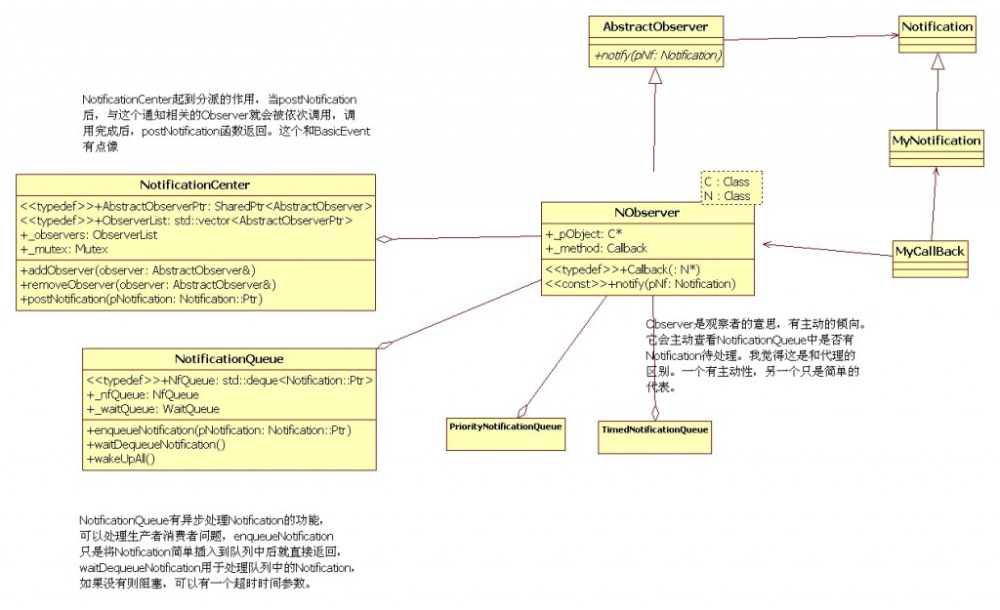
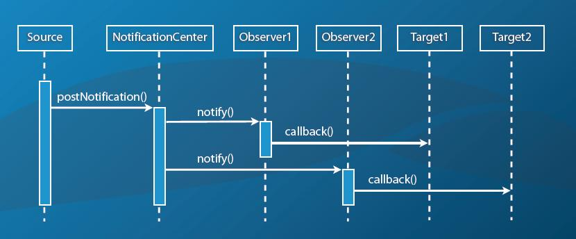
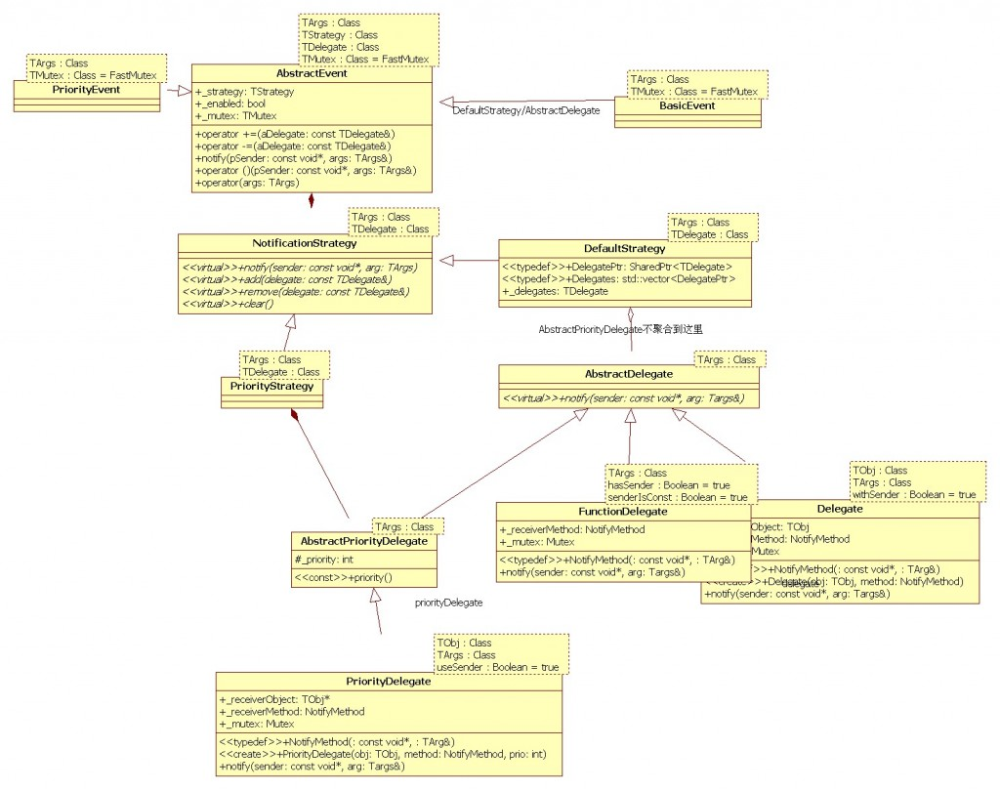
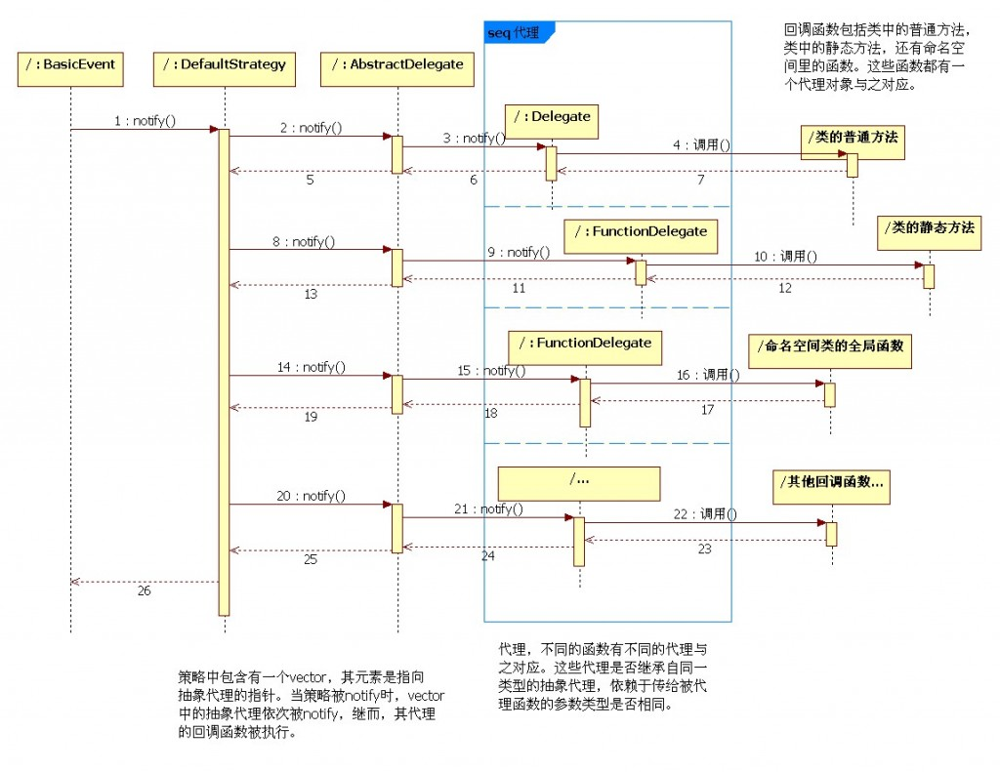
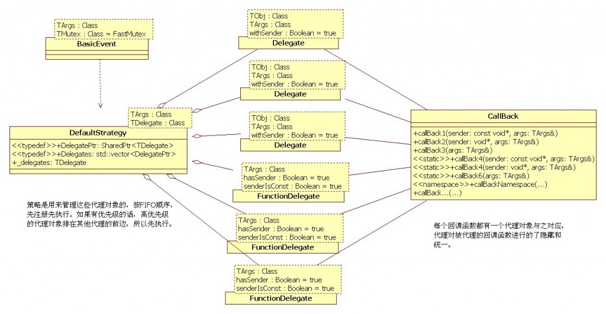
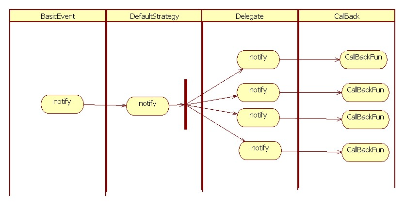
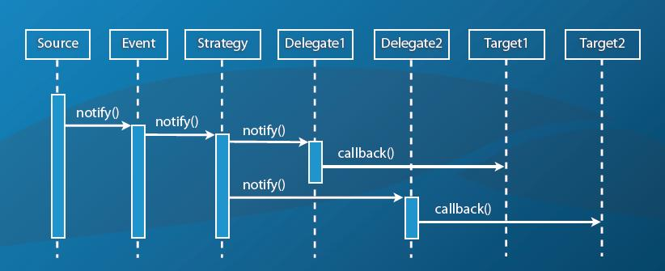

# 参与的角色
数据之间存在关系，在数据库模型里，关系被分为一对一，一对多，多对多。在用计算机去解决数据关系的时候，多对多关系往往被分解成为数个一对多，而一对多的关系最终被分解成为数个一对一关系。再而细化，这个模型里的三个要素就是如下三部分
## 源，发起者，Source
消息存在一个或多个发起者，即消息源Source
## 目标，接收者，Target
消息也存在一个或多个接收者，即目标对象Target　　
## 消息，Message
同时消息Message本身具有内容，即多种消息
# 两种技术实现：通知Notification与事件Event，两种技术均支持同步与异步方式
## 通知
提供了同步或异步执行通知消息的功能，处理生产者消费者模型，在多线程中有用武之地。通知（Notification）和事件（BasicEvent）的区别，我认为是，通知中，Observer会主动查看是否有通知消息，如果没有，会一直阻塞或者阻塞一段时间。Observer在NotificationCenter中会被简单地被回调。事件（BasicEvent）中的代理不会主动查看是否有事件发生，只有事件被触发后，他们会被动的被回调。对于信息（Notification对象和事件中的TArgs参数）的处理，发起端，事件（BasicEvent）是事件的触发（notify）动作，然后代理会被调用；通知（notifycation）是Observer中的主动观察，如果有信息要处理，则处理，没有则阻塞。
  
但此技术中的target（也可称观察者observer）无法得知事件源的情况。通过Poco::NotificationCenter和Poco::NotificationQueue作为消息传递的中间载体，用来对源(source)和目标(target)进行解耦。
  
## 事件Event
Poco的Event模块都是在.h文件中实现的，全部是用模版实现的。它的作用是当某个事件发生时，一些回调函数可以被执行。首先定义一个事件，然后向这个事件注册一些回调函数，当事件发生时，这些回调函数会依次被执行。事件还提供了优先级，超时，异步执行的机制。高优先级的先执行；如果回调函数自注册之时起，超时时间过了，则不再被执行；异步执行，触发事件动作马上返回，而不用等待回调函数的执行完毕。


在这个模块中，有一个很重要的模版函数delegate，它是对Delegate，Expire，FunctionDelegate的包装，使AbstractDelegate的子类可以以一个抽象的接口注册到Strategy中。  
优先级和超时特性所对应的调用关系和上图基本相似，不同点在于：优先级，在向事件注册代理对象时，高优先级的会被插入到策略对象所包含vector容器的前边，从而优先被执行。超时，回调函数所对应的代理对象被notify时，如果超时了，则回调函数不再被执行。这里不再画出所对应的图。


如果target(observer)期望知道事件源的情况，或者想只从某一个确切的源接收事件，可以使用Poco::Event
   
# 同步通知，基于Notification和NotificationCenter
## 消息类，继承自Notification
注意：基于AutoPtr技术，继承自Notification的类不支持值语义操作，不要提供拷贝构造函数和赋值构造函数
## 消息的发起者，NotificationCente
类NotificationCenter类扮演了一个消息源的角色
## 消息的接收者，需要借助Observer类挂接回调　　
```
#include<iostream>
#include<Poco/NotificationCenter.h>
#include<Poco/Notification.h>
#include<Poco/Observer.h>
#include<Poco/NObserver.h>
#include<Poco/AutoPtr.h>
class BaseNotification:public Poco::Notification{
};
class SubNotification:public BaseNotification{
};
class Target{
public:
    void handleBase(BaseNotification* pNf){
        std::cout<<"handleBase: "<<pNf->name()<<std::endl;
        pNf->release();
    }
    void handleSub(const Poco::AutoPtr<SubNotification>& pNf){
        std::cout<<"handleSub:"<<pNf->name()<<std::endl;
    }
};
int main(int argc, char** argv){
    Poco::NotificationCenter nc;
    Target target;
    nc.addObserver(Poco::Observer<Target,BaseNotification>(target,&Target::handleBase));
    nc.addObserver(Poco::NObserver<Target,SubNotification>(target,&Target::handleSub));
    nc.postNotification(new BaseNotification);
    nc.postNotification(new SubNotification);
    nc.removeObserver(Poco::Observer<Target,BaseNotification>(target,&Target::handleBase));
    nc.removeObserver(Poco::NObserver<Target,SubNotification>(target,&Target::handleSub));
    return 0;
}
```
# 异步通知，基于NotificationQueue
Poco中的异步通知是通过NotificationQueue类来实现的，同它功能类似还有类PriorityNotificationQueue和TimedNotificationQueue。不同的是PriorityNotificationQueue类中对消息分了优先级，对优先级高的消息优先处理；而TimedNotificationQueue对消息给了时间戳，时间戳早的优先处理，而和其压入队列的时间无关　　
## 消息类，继承自Notification
## 消息的发起者，NotificationQueue
## 消息的接收者，具有线程性质的类  
```
#include<iostream>
#include<Poco/Notification.h>
#include<Poco/NotificationQueue.h>
#include<Poco/ThreadPool.h>
#include<Poco/Runnable.h>
#include<Poco/AutoPtr.h>
#include<Poco/Stopwatch.h>
class WorkNotification:public Poco::Notification{
public:
    WorkNotification(int data):_data(data){}
    int data()const{
        return _data;
    }
private:
    int _data;
};
class Worker:public Poco::Runnable{
public:
    Worker(Poco::NotificationQueue& queue):_queue(queue){}
    void run(){
        printf("工作线程已启动，thread id = %ld\n", Poco::Thread::currentTid());
        // 在队列中没有消息时候这里会wait，直到其他线程往队列里push消息才会继续运行
        Poco::AutoPtr<Poco::Notification> pNf(_queue.waitDequeueNotification());
        printf("工作线程id = %ld获取到通知\n", Poco::Thread::currentTid());
        while(pNf){
            WorkNotification* pWorkNf=dynamic_cast<WorkNotification*>(pNf.get());
            if(pWorkNf){
                // 在队列中没有消息时候这里会wait，直到其他线程往队列里push消息才会继续运行
                printf("工作线程 id:%ld 执行%d\n", Poco::Thread::currentTid(), pWorkNf->data());
                // 因为不处理什么耗时的事情，所以sleep一会让其他线程也得到机会执行，避免都是1个线程在执行
                Poco::Thread::sleep(10);
            }
            // 如果队列不空则等待下一个消息，此处的队列是否要加锁有待测试
            if (_queue.empty()){
                break;
            }
            pNf = _queue.waitDequeueNotification();
        }
    }
private:
    Poco::NotificationQueue& _queue;
};
int main(int argc, char** argv){
    int nitr = 128;
    {
        Poco::Stopwatch sw;
        sw.start();
        Poco::NotificationQueue queue;
        Worker worker1(queue);
        Worker worker2(queue);
        Worker worker3(queue);
        Worker worker4(queue);
        Poco::ThreadPool::defaultPool().start(worker1);
        Poco::ThreadPool::defaultPool().start(worker2);
        Poco::ThreadPool::defaultPool().start(worker3);
        Poco::ThreadPool::defaultPool().start(worker4);
        // Poco::Thread::sleep(2000);
        printf("启动工作线程完毕\n");
        // 入队n个消息，队列里有消息后，Worker被唤醒时即可开始处理消息
        for(int i=0;i <nitr; ++i){
            queue.enqueueNotification(new WorkNotification(i));
        }
        printf("消息入队完毕\n");
        // 判断队列里的消息是否处理完毕，此部分可以不用
        //while(!queue.empty())
        {
            // Poco::Thread::sleep(10);
        }
        queue.wakeUpAll();
        Poco::ThreadPool::defaultPool().joinAll();
        std::cout<<"dur: " << sw.elapsed()/1000 << " ms" << std::endl;
    }
    return 0;
}
```
# 同步事件
## 数据源Source，事件BasicEvent<T>，目标对象Target
其中source.theEvent += Poco::delegate(&target,  &Target::onEvent)完成了目标向数据源事件注册的过程，target是目标对象实例，Target::onEvent目标对象处理事件的函数入口地址。source.fireEvent(42)触发事件运行

```
#include "Poco/BasicEvent.h"
#include "Poco/Delegate.h"
#include <iostream>

using Poco::BasicEvent;
using Poco::Delegate;

class Source
{
public:
    BasicEvent<int> theEvent;
    void fireEvent(int n)
    {
        theEvent(this, n);
        // theEvent.notify(this, n); // alternative syntax
    }
};

class Target
{
public:
    void onEvent(const void* pSender, int& arg)
    {
        std::cout << "onEvent: " << arg << std::endl;
    }
};

int main(int argc, char** argv)
{
    Source source;
    Target target;
    source.theEvent += Poco::delegate(&target, &Target::onEvent);
    source.fireEvent(42);
    source.theEvent -= Poco::delegate(&target, &Target::onEvent);

    return 0;
}
```
# 异步事件
```
#include "Poco/BasicEvent.h"
#include "Poco/Delegate.h"
#include "Poco/ActiveResult.h"
#include <iostream>

using Poco::BasicEvent;
using Poco::Delegate;
using Poco::ActiveResult;

class TargetAsync
{
public:
    void onAsyncEvent(const void* pSender, int& arg)
    {
        std::cout << "onAsyncEvent: " << arg <<  " Current Thread Id is :" << Poco::Thread::currentTid() << " "<< std::endl;
        return;
    }
};

template<typename RT> class Source
{
public:
    BasicEvent<int> theEvent;
    ActiveResult<RT> AsyncFireEvent(int n)
    {
        return ActiveResult<RT> (theEvent.notifyAsync(this, n));
    }
};

int main(int argc, char** argv)
{
    Source<int> source;
    TargetAsync target;
    std::cout <<  "Main Thread Id is :" << Poco::Thread::currentTid() << " " << std::endl;
    source.theEvent += Poco::delegate(&target, &TargetAsync::onAsyncEvent);
    ActiveResult<int> Targs = source.AsyncFireEvent(43);
    Targs.wait();
    std::cout << "onEventAsync: " << Targs.data() << std::endl;
    source.theEvent -= Poco::delegate(&target, &TargetAsync::onAsyncEvent);

    return 0;
}
```